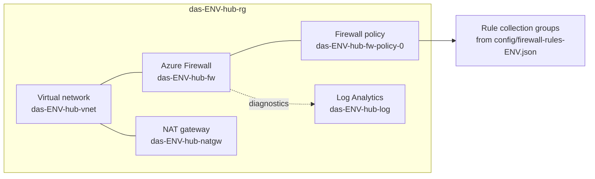
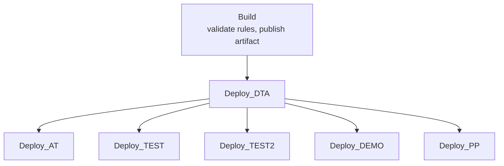

# das-hub-infrastructure

Deploys the DAS hub network for each environment: a virtual network with an
Azure Firewall that filters outbound traffic, a NAT gateway, and a Log
Analytics workspace for the firewall logs.

Everything is ARM templates deployed by one Azure DevOps pipeline. The most
common change by far is adding a firewall rule, which is a single file edit —
see [Adding a firewall rule](#adding-a-firewall-rule).

## What gets deployed

One of these per environment, in its own resource group.



The rule collection groups hanging off the policy are what the files in
`config/` produce. Everything else is fixed infrastructure that rarely changes.

Environments are moving from three groups split by rule type to five groups
split by purpose. AT and DTA have moved; every other environment still uses the
legacy layout.

| Layout | Rule collection group | Priority | Holds |
| --- | --- | --- | --- |
| Tiered (AT, DTA) | `das-critical-infrastructure` | 100 | DNS, AD, management, shared platform services |
| | `das-security-services` | 200 | Key Vault, monitoring, security services |
| | `das-application-network` | 300 | Application-to-application and spoke-to-spoke rules |
| | `das-external-integrations` | 400 | Third-party and network integrations |
| | `das-general` | 500 | General approved outbound connectivity |
| Legacy (everything else) | `Network-Rules-Outbound` | 100 | Network rules |
| | `Application-Rules-Outbound` | 200 | Application rules |
| | `Dnat-Rules-Inbound` | 300 | DNAT rules |

In the tiered layout a group holds a few rule collections, one per rule type and
action, and rules are added to those rather than each rule getting a collection
of its own. Every group draws on the same set of collections, using only the
ones it needs:

| Rule collection | Type | Action | Priority |
| --- | --- | --- | --- |
| `DNAT-Outbound-Allow` | NAT | `DNAT` | 1000 |
| `Application-Outbound-Deny` | Filter | `Deny` | 1500 |
| `Network-Outbound-Allow` | Filter | `Allow` | 2000 |
| `Application-Outbound-Allow` | Filter | `Allow` | 3000 |

A collection name or priority only has to be unique within its group, so the
same collection can appear in several groups.

| Environment | Group | Collections |
| --- | --- | --- |
| AT | `das-application-network` | `DNAT-Outbound-Allow` (empty), `Network-Outbound-Allow`, `Application-Outbound-Allow` |
| DTA | `das-security-services` | `Application-Outbound-Deny` |
| | `das-application-network` | `DNAT-Outbound-Allow`, `Network-Outbound-Allow` |
| | `das-external-integrations` | `Application-Outbound-Allow` |
| | `das-general` | `Application-Outbound-Allow` |

AT's rules are all still in `das-application-network` and have yet to be sorted
by purpose; DTA's are sorted.

Put a Deny collection in a group with a lower priority number than any group
holding an Allow the Deny must beat. Within a rule type, groups are processed in
priority order and the first match wins.

Group names and priorities, and collection names and priorities, all come from
`RELEASE das-hub-infrastructure`.

`hub.template.json` passes the three legacy group names and all eighteen tiered
values to every environment's rules file, so every rules file has to declare all
of them. AT and DTA do. **TEST, TEST2, DEMO and PP do not yet, so their rules
deployment fails** until each is moved to the tiered layout. That failure is at
validation, before any rule is touched, so their live rules stay as they are.

Resource names are never written down anywhere. They are built inside the
template from `das-<resourceEnvironmentName>-<serviceName>`, so `at` plus `hub`
gives `das-at-hub-rg`, `das-at-hub-fw`, and so on.

## Repository layout

| Path | What it is | Change it when |
| --- | --- | --- |
| `config/firewall-rules-<env>.json` | Firewall rules for one environment | Adding, changing or removing a firewall rule |
| `azure/hub.template.json` | Top level template. Creates the resource group and links everything below | Adding a new kind of resource to the hub |
| `azure/templates/` | One template per resource type | Changing how a resource is configured |
| `pipeline.yaml` | The pipeline. One stage per environment | Adding an environment |
| `pipeline-templates/job/build.yml` | Validates the rules, publishes the artifact | Rarely |
| `pipeline-templates/job/deploy-hub.yml` | The deploy job every environment shares | Changing deployment steps |
| `pipeline-templates/step/arm-deploy.yml` | Builds the parameters file and runs the deployment | Rarely |
| `scripts/` | Validation and deployment helpers | Rarely |

## How a deployment runs



Every environment deploys in the same run. Which ones actually proceed is
controlled by approvals on the **Azure DevOps Environment**, not by the
pipeline, so that is where to add a gate.

Each deploy stage runs four steps:

1. **Wait for firewall to be idle** — Azure Firewall accepts one change at a
   time, so this waits for any in-flight update to finish.
2. **Firewall rules being deployed** — logs the rule file for the record.
3. **Generate parameters file** — builds the ARM parameters from the variable
   groups.
4. **Deploy** — subscription scoped, so the template creates its own resource
   group.

A run takes 12 to 15 minutes per environment. Most of that is the firewall
applying rules, and it cannot be sped up.

## Adding a firewall rule

Edit `config/firewall-rules-<env>.json`.

**Tiered environments (AT).** Add the rule to the `rules` array of the matching
collection in the right group: a `NetworkRule` to `Network-Outbound-Allow`, an
`ApplicationRule` to `Application-Outbound-Allow`. Rule names must be unique
within their collection.

```json
{
  "ruleType": "NetworkRule",
  "name": "AllowSubnet-EXAMPLE-SN-Outbound",
  "ipProtocols": [ "TCP" ],
  "sourceAddresses": [ "10.1.2.0/24" ],
  "destinationAddresses": [ "*" ],
  "destinationPorts": [ "443" ]
}
```

**Legacy environments.** Each file holds three rule collection groups; add a
collection to the right one, under `resources[].properties.ruleCollections`.

```json
{
  "name": "AllowSubnet-EXAMPLE-SN",
  "priority": 1500,
  "ruleCollectionType": "FirewallPolicyFilterRuleCollection",
  "action": { "type": "Allow" },
  "rules": [
    {
      "ruleType": "NetworkRule",
      "name": "AllowSubnet-EXAMPLE-SN-Outbound",
      "ipProtocols": [ "TCP" ],
      "sourceAddresses": [ "10.1.2.0/24" ],
      "destinationAddresses": [ "*" ],
      "destinationPorts": [ "443" ]
    }
  ]
}
```

Which group to use:

| Rule type | Group | Filters on |
| --- | --- | --- |
| `NetworkRule` | network | IP address, port, protocol |
| `ApplicationRule` | application | FQDN, URL |
| `NatRule` | DNAT | inbound traffic to a public IP |

`priority` must be unique within its group. Check before pushing:

```powershell
./scripts/validate-firewall-rules.ps1
```

The same check runs in the Build stage, so a mistake fails the run in seconds
rather than part way through a deployment.

## Adding an environment

1. Create the variable group `<ENV> das-hub-infrastructure` and authorise the
   pipeline to use it.
2. Create the Azure DevOps Environment named `<ENV>`, adding an approval if it
   needs one.
3. Add `config/firewall-rules-<env>.json`.
4. Add a stage to `pipeline.yaml`, copying an existing one.

`Deploy_MO` and `Deploy_PRD` are already in `pipeline.yaml`, commented out,
waiting for the first three steps.

## Variable groups

Values shared by every environment live in one group; everything else is per
environment.

**`RELEASE das-hub-infrastructure`**

| Variable | Value |
| --- | --- |
| `location` | `westeurope` |
| `serviceName` | `hub` |
| `subnetName` | `AzureFirewallSubnet` |
| `networkRuleCollectionGroupName` | `Network-Rules-Outbound` |
| `applicationRuleCollectionGroupName` | `Application-Rules-Outbound` |
| `dnatRuleCollectionGroupName` | `Dnat-Rules-Inbound` |
| `criticalInfrastructureRuleCollectionGroupName` | `das-critical-infrastructure` |
| `securityServicesRuleCollectionGroupName` | `das-security-services` |
| `applicationNetworkRuleCollectionGroupName` | `das-application-network` |
| `externalIntegrationsRuleCollectionGroupName` | `das-external-integrations` |
| `generalRuleCollectionGroupName` | `das-general` |
| `criticalInfrastructurePriority` | `100` |
| `securityServicesPriority` | `200` |
| `applicationNetworkPriority` | `300` |
| `externalIntegrationsPriority` | `400` |
| `generalPriority` | `500` |
| `dnatOutboundAllowCollectionName` | `DNAT-Outbound-Allow` |
| `dnatOutboundAllowCollectionPriority` | `1000` |
| `networkOutboundAllowCollectionName` | `Network-Outbound-Allow` |
| `networkOutboundAllowCollectionPriority` | `2000` |
| `applicationOutboundAllowCollectionName` | `Application-Outbound-Allow` |
| `applicationOutboundAllowCollectionPriority` | `3000` |
| `applicationOutboundDenyCollectionName` | `Application-Outbound-Deny` |
| `applicationOutboundDenyCollectionPriority` | `1500` |
| `tags` | `{"Environment":"$(EnvironmentTag)", ...}` |

**`<ENV> das-hub-infrastructure`** — five values, because resource names are
derived rather than listed.

| Variable | Example (AT) |
| --- | --- |
| `resourceEnvironmentName` | `at` |
| `addressPrefix` | `10.0.0.0/16` |
| `subnetPrefix` | `10.0.1.0/26` |
| `SubscriptionId` | `68208b91-0105-498e-a1bc-40d75596c01a` |
| `EnvironmentTag` | `Dev/Test` |

Addressing in use:

| Environment | `addressPrefix` | `subnetPrefix` |
| --- | --- | --- |
| dta | `10.0.0.0/16` | `10.0.1.0/26` |
| at | `10.0.0.0/16` | `10.0.1.0/26` |
| test | `10.20.0.0/16` | `10.20.0.0/26` |
| test2 | `10.30.0.0/16` | `10.30.0.0/26` |
| demo | `10.40.0.0/16` | `10.40.0.0/26` |

Service connections: `SFA-DAS-DevTest-ARM` for DTA, AT, TEST, TEST2 and DEMO,
`SFA-DIG-PreProd-ARM` for PP, `SFA-ASM-ModelOffice-ARM` for MO and
`SFA-DIG-Prod-ARM` for PRD.

> A missing variable does not fail the way you would expect. Azure DevOps
> leaves an undefined `$(name)` as that literal text, so a missing
> `networkRuleCollectionGroupName` would create a rule collection group
> actually called `$(networkRuleCollectionGroupName)`. Check a new group is
> complete before its first run.

## Things worth knowing before changing something

**Azure Firewall applies one change at a time.** A rule collection group update
locks itself and its parent policy for three to five minutes. The groups
deploy in sequence, chained by `dependsOn` inside
`config/firewall-rules-<env>.json`. Remove that chain and they race, and one
fails with
`FirewallPolicyRuleCollectionGroupUpdateNotAllowedWhenUpdatingOrDeleting`.

**That lock outlives the pipeline job.** Cancelling a run does not stop the
update Azure is already applying, so the next run collides with it.
`scripts/wait-for-firewall-idle.ps1` waits for the resource group to settle
first, and fails the job if it cannot run.

**ARM cannot delete rule collection groups.** Removing one from a template
leaves it live in Azure, still enforcing its rules, and renaming a group
creates a second one rather than renaming the first. Delete the old one
explicitly:

```powershell
az network firewall policy rule-collection-group delete `
  -g das-<env>-hub-rg --policy-name das-<env>-hub-fw-policy-0 -n <old-name>
```

**Templates are fetched over HTTPS, not from the artifact.**
`azure/hub.template.json` builds each URI from `templateBaseUri` and
`configBaseUri`, which the pipeline pins to the commit being deployed. So the
repository has to stay public, and deploying a branch really does deploy that
branch.

**Moving an environment to the tiered layout leaves the legacy groups live.**
For the reason above, the three legacy groups keep enforcing their rules after
the new groups deploy. The rules are duplicated rather than changed, but the
legacy groups share priorities 100, 200 and 300 with the new ones, so delete
them once the new groups show `Succeeded`. The names are whatever the
environment's legacy group name variables were; check the portal first. For AT:

```powershell
foreach ($group in 'Network-Rules-Outbound', 'Application-Rules-Outbound', 'Dnat-Rules-Inbound') {
  az network firewall policy rule-collection-group delete `
    -g das-at-hub-rg --policy-name das-at-hub-fw-policy-0 -n $group
}
```

DTA's legacy groups are named `NetworkGroup`, `AppGroup` and `DNAT-Rules`.
Delete `DNAT-Rules` promptly: its DNAT rules duplicate those in
`das-application-network`, and only the first DNAT rule matching a destination
address and port is ever used.

**Rule collection groups at equal priority have no defined order.** If two
groups share a priority, which one's allow or deny wins is undefined. Keep them
distinct.

## Deploying a branch

Queue the pipeline against the branch. The Build stage checks it out and
publishes it as the artifact, and the template URIs are pinned to that commit,
so a branch deployment is a real test of that branch rather than of `main`.
